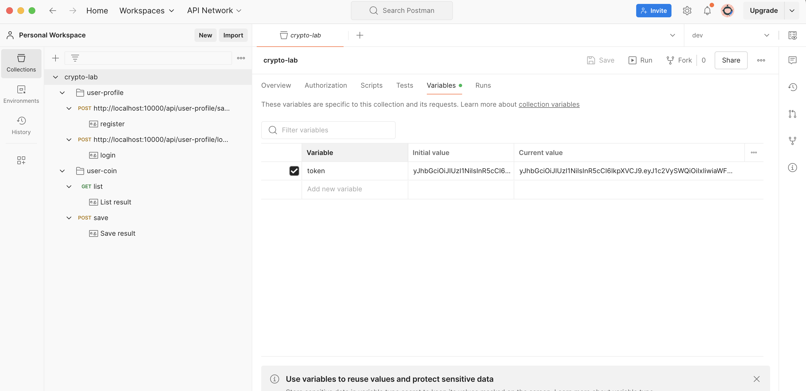

# crypto-lab
This is a system overview of Crypto-lab. Crypto-lab uses Next.js as the front end and Nest.js as the back end. There are two systems in the Back-end. First is a database. The second is Crypto API. The system can change Crypto API.


# Project setup
```console
git clone git@github.com:chaluemwut/crypto-demo.git
cd crypto-demo
cd deploy
sudo docker compose up -d
```
Go to http://localhost:3000


# API Key setup
Install a COINGECKO key at api/.env

API_KEY_COINGECKO=COINGECKO api key

# Postman API Document


# Import JSON file to Postman
File at resource/crypto-lab.postman_collection.json
